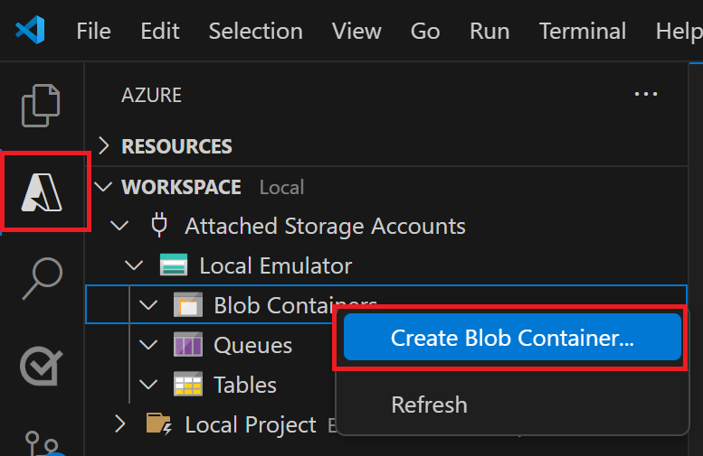
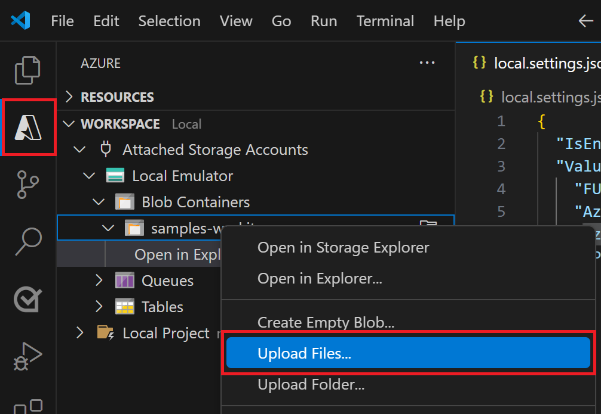
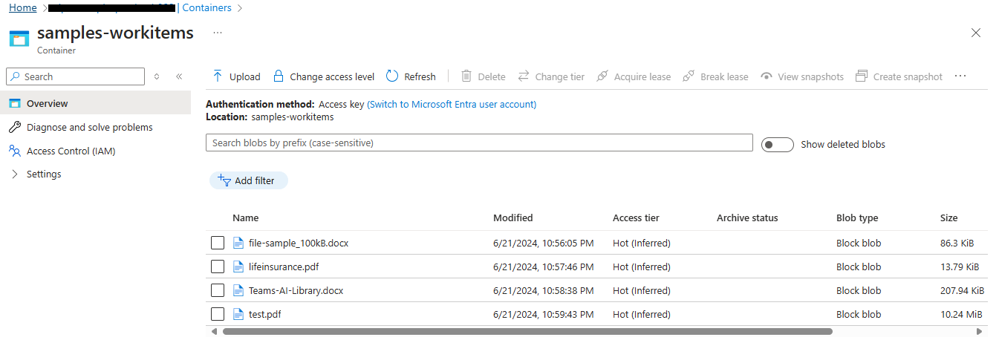

# Setup Azure Function for Storing Embedding Vectors in CosmosDB

## Create an Azure Open AI service

- In Azure portal, create an [Azure Open AI service](https://learn.microsoft.com/en-us/azure/ai-services/openai/how-to/create-resource?pivots=web-portal).
- Create and collect `AzureOpenAIEndpoint`, `AzureOpenAIApiKey`, `AzureOpenAIDeploymentName` and save these values to update in `.local.settings.json` file later.

- **Deploy Azure Open AI model:** Deploy the `text-embedding-ada-002` model in your created Azure Open AI service for the application to create embedding vectors.


## Create and Configure Azure CosmosDB for NoSQL

 - **[Create Azure CosmosDB Account](https://learn.microsoft.com/en-us/azure/cosmos-db/nosql/quickstart-portal#create-account)** in Azure portal and [Enroll in the Vector Search Preview Feature](https://learn.microsoft.com/en-us/azure/cosmos-db/nosql/vector-search#enroll-in-the-vector-search-preview-feature)
  
 - Create and collect `CosmosDBEndpoint`, `CosmosDBKey`, `CosmosDBDatabaseId`, `CosmosDBContainerId`, `PartitionKey` and save these values to update in `.local.settings.json` file later.

## Create Azure Blob storage

- In Azure portal, create an [Azure Blob storage](https://learn.microsoft.com/en-us/azure/storage/blobs/storage-blobs-introduction).
- Create and collect `AzureStorageDBConnString`, `AzureBlobContainerName` and save these values to update in `.local.settings.json` file later.

## Create Azure Function

- [Create the function app](https://learn.microsoft.com/en-us/azure/azure-functions/functions-event-grid-blob-trigger?pivots=programming-language-javascript#create-the-function-app)
- [Update application settings](https://learn.microsoft.com/en-us/azure/azure-functions/functions-event-grid-blob-trigger?pivots=programming-language-javascript#update-application-settings)
- [Build the endpoint URL](https://learn.microsoft.com/en-us/azure/azure-functions/functions-event-grid-blob-trigger?pivots=programming-language-javascript#build-the-endpoint-url)

## Create Azure App Insights
- [Azure App Insights](https://learn.microsoft.com/en-us/azure/azure-monitor/app/nodejs)
- Create and collect `APPINSIGHTS_INSTRUMENTATIONKEY`, `APPINSIGHTS_CONNECTIONSTRING` and save these values to update in `.local.settings.json` file later.


## Create the Event Subscription
**> Note: Please follow the documentation below carefully to successfully set up and run your Azure Function.**

- [Create the event subscription](https://learn.microsoft.com/en-us/azure/azure-functions/functions-event-grid-blob-trigger?pivots=programming-language-javascript#create-the-event-subscription).

- [Trigger Azure Functions on blob containers using an event subscription](https://learn.microsoft.com/en-us/azure/azure-functions/functions-event-grid-blob-trigger?pivots=programming-language-javascript#create-the-event-subscription).

## Code Setup

  - Clone the repository

    ```bash
    git clone https://github.com/OfficeDev/Microsoft-Teams-Samples.git
    ```
  - Navigate to `samples/api-doc-search/azure-function-nodejs` folder and open the project in Visual Studio Code.
  - Open `.local.settings1.json` file and rename it as `.local.settings.json` and update the configuration for the application for below values:

      - `"AzureWebJobsStorage": ""`: Use `"UseDevelopmentStorage=true"` to connect to the local Azure Storage Emulator; replace with actual Azure Storage connection string for deployment. e.g., `"DefaultEndpointsProtocol=https;AccountName=your_account_name;AccountKey=your_account_key;BlobEndpoint=https://your_account_name.blob.core.windows.net/"`.
      
      - `"FUNCTIONS_WORKER_RUNTIME": "node"`: Set to `"node"` for Node.js runtime (same for local and deployment).
      - `"AzureWebJobsFeatureFlags"`: Use `"EnableWorkerIndexing"` for local testing if indexing features are needed; omit or adjust based on production needs.
      - `"c0008c_STORAGE""`: Use `"UseDevelopmentStorage=true"` for local testing with Azure Blob Storage Emulator; replace with actual Azure Blob Storage connection string for deployment.
      - `"AzureOpenAIEndpoint": ""`: Enter the endpoint URL for Azure OpenAI service e.g., `"https://your-openai-resource.openai.azure.com/"`.
      - `"AzureOpenAIApiKey": ""`: Enter the API key for accessing Azure OpenAI service.
      - `"AzureOpenAIDeploymentName": "text-embedding-ada-002"`: Specifies the deployment name for Azure OpenAI's text embedding model.
      - `"CosmosDBEndpoint": ""`: Enter the endpoint URL for Azure Cosmos DB e.g., `"https://your-cosmosdb-account.documents.azure.com:443/"`.
      - `"CosmosDBKey": ""`: Enter the key for Azure Cosmos DB access.
      - `"CosmosDBDatabaseId": ""`: Enter the ID of the Cosmos DB database.
      - `"CosmosDBContainerId": ""`: Enter the ID of the Cosmos DB container.
      - `"PartitionKey":""`: Enter the partition key used in Cosmos DB for partitioning data.
      - `"AzureStorageDBConnString": ""`: Enter the actual Azure Storage database connection string for deployment.
      - `"AzureBlobContainerName": ""`: Enter the name of the Azure Blob storage container.
      - `"APPINSIGHTS_INSTRUMENTATIONKEY": ""`: Enter the Instrumentation Key for Azure Application Insights.
      - `"APPINSIGHTS_CONNECTIONSTRING": ""`: Enter the connection string for Azure Application Insights.

  - Go to `src` folder, open `src/BlobTriggerEventGrid.js` file, and update below details:
      - `path`: The `path` property specifies the path pattern for the blob storage container and the blob name that  triggers the Azure Function. It includes placeholders to dynamically capture the actual blob name.
           - **Format:** `'samples-workitems/{name}'` (`samples-workitems`: The name of the Azure Blob storage container. Your function will listen for events (such as blob creation or modification) specifically in this container.)
           - `{name}`: A placeholder that gets replaced with the actual name of the blob that triggered the event. This allows your function to process the specific blob involved in the event. 
           - **Example:** If a blob named `example-file.txt` is added to the `samples-workitems` container, your function     will be triggered with the `blobName` as `example-file.txt.`
      - `source`: The `source` property specifies the origin of the events that trigger the Azure Function.
      
           - **Value:** `'EventGrid'` (Indicates that the events are coming from Azure Event Grid. Azure Event Grid is a service that enables you to easily build event-based architectures by reacting to changes or events in Azure services, such as Blob storage.)
           - **Usage:** This value is typically set to `'EventGrid'` when your function is designed to respond to events delivered by Azure Event Grid.
      
      - `connection` : The `connection` property specifies the name of the application setting that contains the connection string for your Azure Storage account. This connection string is used by the function to connect to Azure Storage. 
           - **Value:** `'c0008c_STORAGE'` (This is the name of the application setting where the connection string for Azure Storage is stored. It should match the name you use in your Azure Function App’s configuration in `.local.settings.json`.)

 - In a terminal, navigate to `samples/api-doc-search/azure-function-nodejs`

 - Install node modules and run application by pressing F5 in Visual Studio Code
 
   ```bash
    npm install
   ```

## Running the sample locally by uploading file in local emulated storage

Step: 1 [Prepare local storage emulation](https://learn.microsoft.com/en-us/azure/azure-functions/functions-event-grid-blob-trigger?pivots=programming-language-javascript#prepare-local-storage-emulation) and [Run the azure function locally](https://learn.microsoft.com/en-us/azure/azure-functions/functions-event-grid-blob-trigger?pivots=programming-language-javascript#run-the-function-locally)

  

Step 2: [Upload the file in local emulated storage and it will trigger Azure function locally and Azure function with start creating and storing embedding vectors in CosmosDB](https://learn.microsoft.com/en-us/azure/azure-functions/functions-event-grid-blob-trigger?pivots=programming-language-javascript#upload-a-file-to-the-container)

  

Step 3: [Run the function locally](https://learn.microsoft.com/en-us/azure/azure-functions/functions-event-grid-blob-trigger?pivots=programming-language-javascript#prepare-local-storage-emulation)

  

  - After running Azure function, provide file name like: `abc.pdf` it will start creating the required vector embeddings for uploaded file and store the vectors in the Azure NoSQL Cosmos DB.

  

## Running the deployed Azure function by uploading file in Azure Blob storage
**Note: Before running the Azure function, make sure you have deployed the Azure function and updated the configuration settings in Azure portal.**
**Also, follow [Trigger Azure Functions on blob containers using an event subscription](https://learn.microsoft.com/en-us/azure/azure-functions/functions-event-grid-blob-trigger?pivots=programming-language-javascript#create-the-event-subscription) to create event that will trigger Azure function once file is uploaded to Azure blob storage.**

[Upload a file to the blob container and it will trigger Azure function automatically and Azure function with start creating and storing embedding vectors in CosmosDB](https://learn.microsoft.com/en-us/azure/azure-functions/functions-event-grid-blob-trigger?pivots=programming-language-javascript#upload-a-file-to-the-container)

- **Upload file to Azure Blob container:** Upload the file(s) for which you want to create vector embeddings into the Blob Storage container.
  

- **Azure Function Invocation:** Uploading the files to blob will automatically trigger the Azure function which will start creating the required vector embeddings and store in the Azure NoSQL Cosmos DB.
  

  

## Deploy the Azure Function (Optional)

[Deploy your function code to azure function](https://learn.microsoft.com/en-us/azure/azure-functions/functions-event-grid-blob-trigger?pivots=programming-language-javascript#deploy-your-function-code)

Note> After code deployment to web app service in Azure, make sure to update all the configuration settings (`Environment variables`) in Azure portal.

## Further reading

- [Azure CosmosDB](https://learn.microsoft.com/en-us/azure/cosmos-db/nosql/vector-search)

- [Vector Search Preview Feature](https://learn.microsoft.com/en-us/azure/cosmos-db/nosql/vector-search#enroll-in-the-vector-search-preview-feature)

- [Azure Open AI Service](https://learn.microsoft.com/en-us/azure/ai-services/openai/overview)

- [Azure Function](https://learn.microsoft.com/en-us/azure/azure-functions/functions-event-grid-blob-trigger?pivots=programming-language-javascript)

- [Azure Blob Storage](https://learn.microsoft.com/en-us/azure/storage/blobs/storage-blobs-introduction)

- [Azure App Insights](https://learn.microsoft.com/en-us/azure/azure-monitor/app/nodejs)

- [Trigger Azure Functions on blob containers using an event subscription](https://learn.microsoft.com/en-us/azure/azure-functions/functions-event-grid-blob-trigger?pivots=programming-language-javascript#deploy-your-function-code)