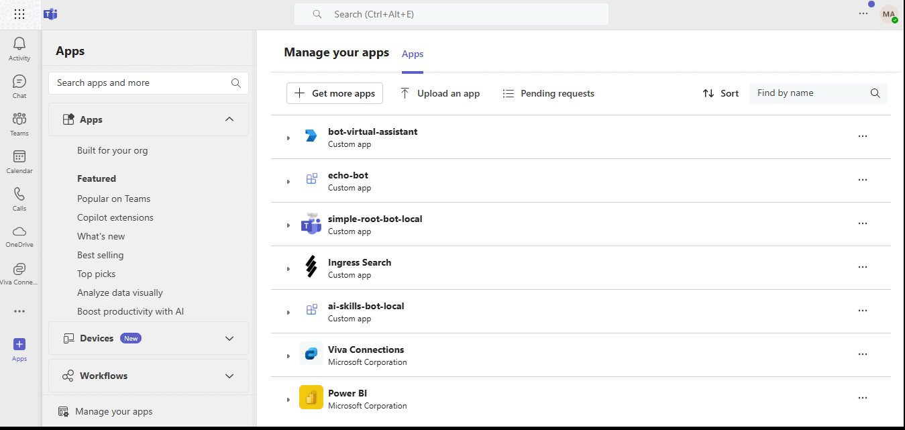
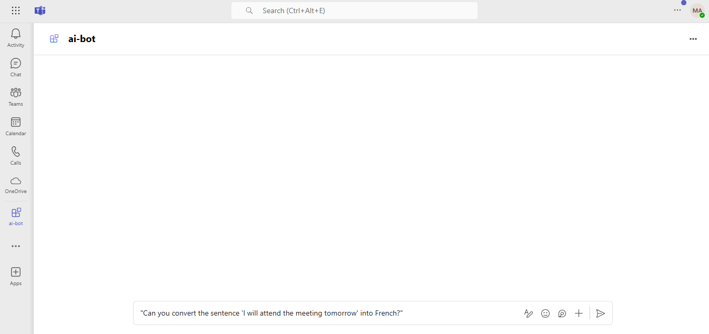
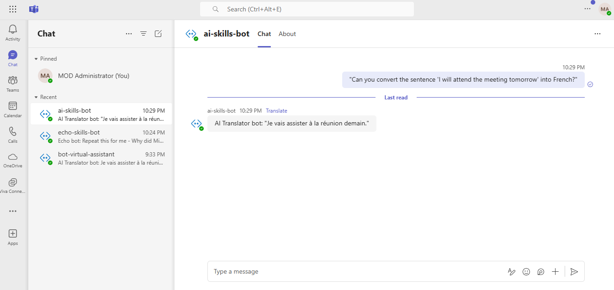

# AI Skill Bot

This AI Translator Skill Bot takes user-provided text, translates it into the desired language, and then returns the translated response to the user. It operates smoothly in both personal chats and within Teams channels, showcasing its functionality across different communication contexts.

**Note: This skill bot will be called by the main Virtual Assistant bot (Root Bot) to perform translations and return the translated response to the user.**

You can create a new skill bot by following the steps mentioned in the [Create a skill](https://learn.microsoft.com/en-us/azure/bot-service/skill-implement-skill?view=azure-bot-service-4.0&tabs=cs) documentation.

## Included Features
* Bots

## Interaction with the Bot



## Prerequisites

- Microsoft Teams is installed and you have an valid [M365 account](https://www.microsoft.com/en-us/microsoft-365/what-is-microsoft-365?msockid=00bf51c23fe96f65186b42723e726e7f)
- [NodeJS](https://nodejs.org/en/)
- [dev tunnel](https://learn.microsoft.com/en-us/azure/developer/dev-tunnels/get-started?tabs=windows) or [ngrok](https://ngrok.com/) latest version or equivalent tunnelling solution
- [Visual Studio Code](https://code.visualstudio.com/Download) or any other code editor
- An [Azure subscription](https://learn.microsoft.com/en-us/microsoft-365/enterprise/subscriptions-licenses-accounts-and-tenants-for-microsoft-cloud-offerings?view=o365-worldwide) with permissions to create resources
- [Azure Open AI Service](https://learn.microsoft.com/en-us/azure/ai-services/openai/overview)

## Setup for App Registration

1. Register a new application in the [Microsoft Entra ID – App Registrations](https://go.microsoft.com/fwlink/?linkid=2083908) portal.
2. Select **+ New Registration** and on the *Register an application page*, set following values:
    * Set **Name** to your app name.
    * Choose the **Supported account types** as `Accounts in any organizational directory (Any Microsoft Entra ID tenant - Multitenant)` (MultiTenant) only (If you created your Virtual Assistant (root bot) as MultiTenant then you should select same here). For more information, see [Supported account types](https://learn.microsoft.com/en-us/azure/bot-service/skill-implement-skill?view=azure-bot-service-4.0&tabs=cs):
    
    
    * Leave **Redirect URI** as empty.
    * Click on **Register** button to create app registration.
3. On the overview page, copy and save the **Application (client) ID, Directory (tenant) ID**. You’ll need those values later when updating your `appPackage (manifest.json file)` and `.env` file configuration in sample code.
4. Navigate to **Certificates & secrets**. In the Client secrets section:
    * Click on **"+ New client secret"**.
    * Add a description (Name of the secret) for the secret and select “Never” for Expires.
    * Click "Add" button.
    * Once the client secret is created, copy its value and save. It will be required later to add in the `.env` file configuration in sample code.

## Setup NGROK
   Run ngrok - point to port 39784

   ```bash
   ngrok http 39784 --host-header="localhost:39784"
   ```

   Alternatively, you can also use the `dev tunnels`. Please follow [Create and host a dev tunnel](https://learn.microsoft.com/en-us/azure/developer/dev-tunnels/get-started?tabs=windows) and host the tunnel with anonymous user access command as shown below:

   ```bash
   devtunnel host -p 39784 --allow-anonymous
   ```

## Setup the Azure bot
- In Azure portal, create an [Azure Bot resource](https://docs.microsoft.com/azure/bot-service/bot-service-quickstart-registration).
    - Fill all the required information including the bot name.
    - Select **supported account types** as `MultiTenant` and select `Use existing app registration` and provide app registration id (Application (client) ID) created while creating app registration in previous steps.
    - __*If you don't have an Azure account*__ create an [Azure free account here](https://azure.microsoft.com/free/)
    
- Open newly created Azure Bot resource in the Azure Portal and update the following settings:
    - Ensure that you've [enabled the Teams Channel](https://learn.microsoft.com/en-us/azure/bot-service/channel-connect-teams?view=azure-bot-service-4.0#configure-your-bot-in-azure)
    - In Settings/Configuration/Messaging endpoint, enter the current `https` URL you were given by running the tunneling application (NGROK/Devtunnel URL). Append with the path `/api/messages`
    for example: `https://12345.ngrok-free.app/api/messages` or `https://12345.devtunnels.ms/api/messages` or  `https://abc.azurewebsites.net`

## Create an Azure Open AI service

- In Azure portal, create an [Azure Open AI service](https://learn.microsoft.com/en-us/azure/ai-services/openai/how-to/create-resource?pivots=web-portal).
- **Deploy Azure Open AI model:** Deploy the `gpt-35-turbo` model in your created Azure Open AI service for the application to perform translation.
- Collect `AzureOpenAIEndpoint`, `AzureOpenAIApiKey`, `AzureOpenAIDeploymentName` values and save these values to update in `.env` file later.

## Setup the code
1) Clone the repository

    ```bash
    git clone https://github.com/OfficeDev/Microsoft-Teams-Samples.git
    ```

2) In a terminal, navigate to `samples/bot-virtual-assistant/ai-skill-bot`

3) Install node modules

   Inside `ai-skill-bot` folder, open your local terminal and run the below command to install `node modules`. You can do the same in `Visual Studio Code` terminal by opening the project in Visual Studio Code.

    ```bash
    npm install
    ```

4) Open and modify the `.env` file contained in your project folder (Open it in Visual Studio Code or any other editor) and fill in below details:
   - `MicrosoftAppType` - The value for app type will be `MultiTenant` because we have configured the application to support `MultiTenant` Including Virtual Assistant (root bot) which is going to call this skill bot.
   - `MicrosoftAppId` - Generated while registering your application. (Application (client) ID) is the application app id.
   - `MicrosoftAppPassword` - Generated while registering your application. Also referred to as Client secret.
   - `MicrosoftAppTenantId` - Put it as blank as we are using MultiTenant app.
   - `AllowedCallers` - ID of the application that are allowed to call this skill bot (AI skill bot). In this case, please provide the app registration id of your main Virtual Assistant Bot (Root Bot).
   - `AzureOpenAIDeploymentId` - Generated while creating Azure Open AI service (`AzureOpenAIDeploymentName` value).
   - `AzureOpenAIApiKey` - Generated while creating Azure Open AI service (`AzureOpenAIApiKey` value).
   - `AzureOpenAIEndpoint` - Generated while creating Azure Open AI service (`AzureOpenAIEndpoint` value).

5) Run your application locally

    ```bash
    npm start
    ```
    Or you can run the app in Visual Studio Code by pressing `F5`.

## Setup App Package (Manifest) for Teams Client

1. Modify the `manifest.json` available in the `/appPackage` folder in your opened project in `Visual Studio Code` and replace the following details:
   - `{{MicrosoftAppId}}` It can be any GUID or you can add your app registration id as well which was generated while registering or creating the app registration in Azure portal.
   - `{{BotId}}` Replace with your app registration id which was generated while registering or creating the app registration in Azure portal.
   - `{Base_URL_Domain}` - Your application's base url domain. E.g. for https://12345.ngrok-free.app the base url domain will be `12345.ngrok-free.app` when you are using ngrok and if you are using dev tunnels then your domain will be like: `12345.devtunnels.ms`. If you have deployed the application in Azure app service, please use like `xyz.azurewebsites.net`.

2. Zip the contents of the `appPackage` folder to create a `manifest.zip` file. (Make sure that zip file does not contains any subfolder otherwise you will get error while uploading your .zip package) 

3. Upload the `manifest.zip` file to Teams (in the Apps view click **"Upload a custom app"**)
   - Go to **Microsoft Teams** and then go to side panel, select Apps
   - Choose [Upload a custom App](https://learn.microsoft.com/en-us/microsoftteams/platform/concepts/deploy-and-publish/apps-upload#upload-your-app) (If it is not enabled, please contact your Teams admin to enable this feature or you can also refer [Allow users to upload custom apps](https://learn.microsoft.com/en-us/microsoftteams/teams-custom-app-policies-and-settings#allow-users-to-upload-custom-apps))
   - Go to your project directory and `./appPackage` folder, select the zip folder, and choose Open.
   - Select Add in the opened pop-up dialog box. Your app will be uploaded to Teams.

## Running the sample

You can interact with this AI translator skill bot in Teams by sending it a message. The bot will translate the message into the desired language and return the translated response.

**User Prompt:** 

`Can you convert the sentence 'I will attend the meeting tomorrow' into French?`



**Bot Response:** 

`AI Translator bot: "Je vais assister à la réunion demain."`



## Deploy the app to Azure
If you want to deploy the app to Azure, you can follow the below steps:
- Create an Azure app service in Azure portal that support `NodeJS`.
- Deploy the code to the app service.

To learn more about deploying a `NodeJS` app to Azure, see [Configure the App Service app and deploy the code](https://learn.microsoft.com/en-us/azure/app-service/quickstart-nodejs?tabs=windows&pivots=development-environment-vscode#configure-the-app-service-app-and-deploy-code) for a complete list of deployment instructions.

## Further reading

- [Implement a skill](https://learn.microsoft.com/en-us/azure/bot-service/skill-implement-skill?view=azure-bot-service-4.0&tabs=cs)
- [Bot Basics](https://docs.microsoft.com/azure/bot-service/bot-builder-basics?view=azure-bot-service-4.0)
- [Azure Bot Service Introduction](https://docs.microsoft.com/azure/bot-service/bot-service-overview-introduction?view=azure-bot-service-4.0)
- [Azure Bot Service Documentation](https://docs.microsoft.com/azure/bot-service/?view=azure-bot-service-4.0)

