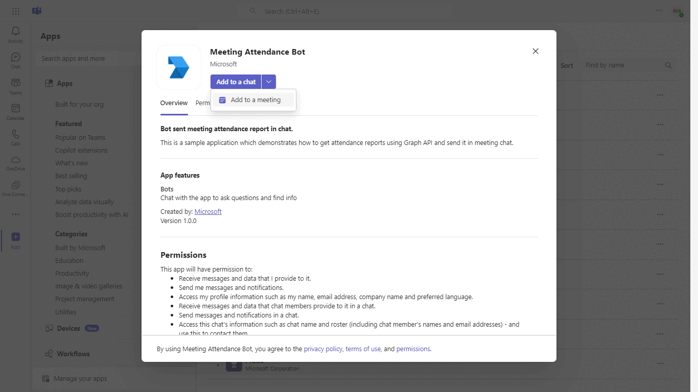
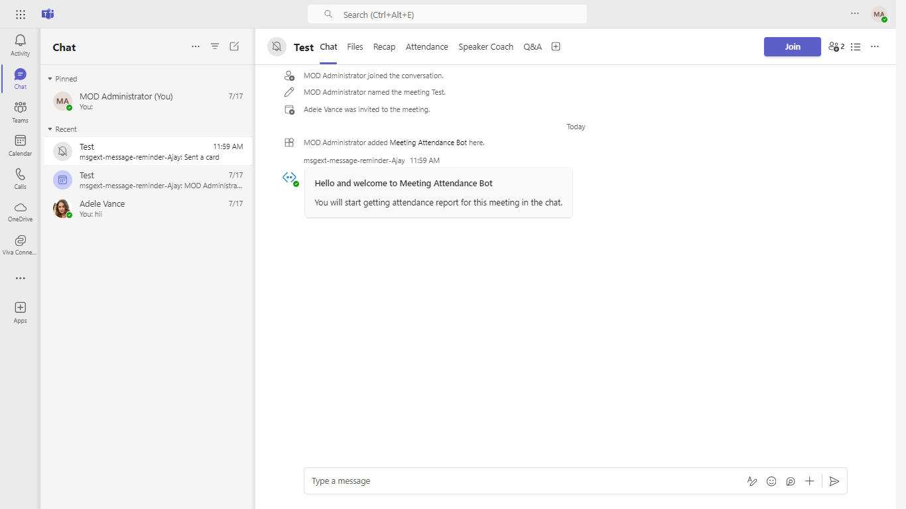

# Meeting attendance report

This is a sample application which demonstrates how to get meeting attendance report using Graph API and send it in meeting chat.

## Included Features
* Bots
* Graph API

## Interaction with app

When meeting ends, attendance report card is sent by the bot.



## Prerequisites

- [.NET Core SDK](https://dotnet.microsoft.com/download) version 6.0

  ```bash
  # determine dotnet version
  dotnet --version
  ```
- Publicly addressable https url or tunnel such as [dev tunnel](https://learn.microsoft.com/en-us/azure/developer/dev-tunnels/get-started?tabs=windows) or [ngrok](https://ngrok.com/) latest version or [Tunnel Relay](https://github.com/OfficeDev/microsoft-teams-tunnelrelay) 

## Setup

1. Register a new application in the [Microsoft Entra ID – App Registrations](https://go.microsoft.com/fwlink/?linkid=2083908) portal.
      -  Click on "New registration", and create an Azure AD application.

    -  **Name:**  The name of your Teams app - if you are following the template for a default deployment, we recommend "App catalog lifecycle".

    -  **Supported account types:**  Select "Accounts in any organizational directory"

    -  Leave the "Redirect URL" field blank.   

    - Click on the "Register" button.

    - When the app is registered, you'll be taken to the app's "Overview" page. Copy the  **Application (client) ID**; we will need it later. Verify that the "Supported account types" is set to  **Multiple organizations**.

    -  On the side rail in the Manage section, navigate to the "Certificates & secrets" section. In the Client secrets section, click on "+ New client secret". Add a description for the secret and select Expires as "Never". Click "Add".

    -  Once the client secret is created, copy its  **Value**, please take a note of the secret as it will be required later.

    - At this point you have 3 unique values:
        -   Application (client) ID which will be later used during Azure bot creation
        -   Client secret for the bot which will be later used during Azure bot creation
        -   Directory (tenant) ID
    We recommend that you copy these values into a text file, using an application like Notepad. We will need these values later.

    -  Under left menu, navigate to  **API Permissions**, and make sure to add the following permissions of Microsoft Graph API > Application permissions:
        -  OnlineMeetingArtifact.Read.All

    Click on Add Permissions to commit your changes.

    - If you are logged in as the Global Administrator, click on the Grant admin consent for %tenant-name% button to grant admin consent else, inform your admin to do the same through the portal or follow the steps provided here to create a link and send it to your admin for consent.

    - Global Administrator can grant consent using following link:  [https://login.microsoftonline.com/common/adminconsent?client_id=](https://login.microsoftonline.com/common/adminconsent?client_id=)<%appId%> 
  

2. Setup for Bot SSO

- Register a bot with Azure Bot Service, following the instructions [here](https://docs.microsoft.com/en-us/azure/bot-service/bot-service-quickstart-registration?view=azure-bot-service-3.0).
- Ensure that you've [enabled the Teams Channel](https://docs.microsoft.com/en-us/azure/bot-service/channel-connect-teams?view=azure-bot-service-4.0)
- While registering the bot, use `https://<your_tunnel_domain>/api/messages` as the messaging endpoint.
    > NOTE: When you create your bot you will create an App ID and App password - make sure you keep these for later.
    
3. Allow applications to access online meetings on behalf of a user

- Follow this link- [Configure application access policy](https://docs.microsoft.com/en-us/graph/cloud-communication-online-meeting-application-access-policy)

- **Note**: Copy the User Id you used to granting the policy. You need while configuring the appsettings.json file.
    
4. Setup NGROK
 - Run ngrok - point to port 3978

   ```bash
   ngrok http 3978 --host-header="localhost:3978"
   ```  

   Alternatively, you can also use the `dev tunnels`. Please follow [Create and host a dev tunnel](https://learn.microsoft.com/en-us/azure/developer/dev-tunnels/get-started?tabs=windows) and host the tunnel with anonymous user access command as shown below:

   ```bash
   devtunnel host -p 3978 --allow-anonymous
   ```

- Once started you should see URL  `https://123.ngrok-free.app` if you are using Ngrok and if you are using dev tunnels, your URL will be like: https://12345.devtunnels.ms. Copy it, this is your baseUrl that will used as endpoint for Azure bot and webhook.

5. Setup for code

- Clone the repository

    ```bash
    git clone https://github.com/OfficeDev/Microsoft-Teams-Samples.git
    ```
-  Update the `appsettings.json` configuration for the bot to use the `MicrosoftAppId` and `MicrosoftAppPassword` and `MicrosoftAppTenantId` and `AppBaseUrl` and `UserId` (Note that the MicrosoftAppId is the AppId created in step 1 , the MicrosoftAppPassword is referred to as the "client secret" in step 4 and you can always create a new client secret anytime., MicrosoftAppTenantId is reffered to as Directory tenant Id in step 1, AppBaseUrl is the URL that you get in step 2 after running the tunnelling application, UserId of the user used while granting the policy in step 1). 
- Run the bot from a terminal or from Visual Studio:

  A) From a terminal, navigate to `MeetingAttendance`

  ```bash
  # run the bot
  dotnet run
  ```

  B) Or from Visual Studio

- Launch Visual Studio
- File -> Open -> Project/Solution
- Navigate to `samples/meetings-attendance-report/csharp` folder
- Select `MeetingAttendance.csproj` file
- Press `F5` to run the project


6. Setup Manifest for Teams

- **This step is specific to Teams.**
    - **Edit** the `manifest.json` contained in the  `AppManifest` folder to replace your Microsoft App Id (that was created when you registered your bot earlier) *everywhere* you see the place holder string `<<Your Microsoft App Id>>` (depending on the scenario it may occur multiple times in the `manifest.json`) Also replace the <<GUID>> with any valid GUID or with your MicrosoftAppId 
    - **Edit** the `manifest.json` for `configurationUrl` inside `configurableTabs` . Replace `<your_tunnel_domain>` with base Url domain. E.g. if you are using ngrok it would be `https://1234.ngrok-free.app` then your domain-name will be `1234.ngrok-free.app` and if you are using dev tunnels then your domain will be like: `12345.devtunnels.ms`.
    - **Edit** the `manifest.json` for `validDomains` with base Url domain. E.g. if you are using ngrok it would be `https://1234.ngrok-free.app` then your domain-name will be `1234.ngrok-free.app` and if you are using dev tunnels then your domain will be like: `12345.devtunnels.ms`.
    - **Zip** up the contents of the `AppManifest` folder to create a `manifest.zip` (Make sure that zip file does not contains any subfolder otherwise you will get error while uploading your .zip package)
    - **Upload** the `manifest.zip` to Teams (In Teams Apps/Manage your apps click "Upload an app". Browse to and Open the .zip file. At the next dialog, click the Add button.)
    - Add the app to personal/team/groupChat scope (Supported scopes)

**Note**: If you are facing any issue in your app, please uncomment [this](https://github.com/OfficeDev/Microsoft-Teams-Samples/blob/main/samples/meetings-attendance-report/csharp/MeetingAttendance/AdapterWithErrorHandler.cs#L23) line and put your debugger for local debug.

## Running the sample

**Schedule the meeting and add Meeting Attendance Bot from Apps section in that particular scheduled meeting:**


**Add Meeting UI:**


**On installation you will get a welcome card**



**Once the bot is installed in the meeting, whenever meeting ends bot will send attendance report:** 


## Deploy the bot to Azure

To learn more about deploying a bot to Azure, see [Deploy your bot to Azure](https://aka.ms/azuredeployment) for a complete list of deployment instructions.

## Further reading
- [List Meeting Attendance Reports](https://docs.microsoft.com/en-us/graph/api/meetingattendancereport-list?view=graph-rest-1.0&tabs=http)
- [List Attendance Records](https://docs.microsoft.com/en-us/graph/api/attendancerecord-list?view=graph-rest-1.0&tabs=http)
- [Configure application access policy](https://docs.microsoft.com/en-us/graph/cloud-communication-online-meeting-application-access-policy)
- [Bot Framework Documentation](https://docs.botframework.com)
- [Bot Basics](https://docs.microsoft.com/azure/bot-service/bot-builder-basics?view=azure-bot-service-4.0)
- [Azure Portal](https://portal.azure.com)
- [Add Authentication to Your Bot Via Azure Bot Service](https://docs.microsoft.com/en-us/azure/bot-service/bot-builder-authentication?view=azure-bot-service-4.0&tabs=csharp)
- [Activity processing](https://docs.microsoft.com/en-us/azure/bot-service/bot-builder-concept-activity-processing?view=azure-bot-service-4.0)
- [Azure Bot Service Introduction](https://docs.microsoft.com/azure/bot-service/bot-service-overview-introduction?view=azure-bot-service-4.0)
- [Azure Bot Service Documentation](https://docs.microsoft.com/azure/bot-service/?view=azure-bot-service-4.0)
- [.NET Core CLI tools](https://docs.microsoft.com/en-us/dotnet/core/tools/?tabs=netcore2x)
- [Azure CLI](https://docs.microsoft.com/cli/azure/?view=azure-cli-latest)
- [Azure Portal](https://portal.azure.com)
- [Language Understanding using LUIS](https://docs.microsoft.com/en-us/azure/cognitive-services/luis/)
- [Channels and Bot Connector Service](https://docs.microsoft.com/en-us/azure/bot-service/bot-concepts?view=azure-bot-service-4.0)
- [Microsoft Teams Developer Platform](https://docs.microsoft.com/en-us/microsoftteams/platform/)


